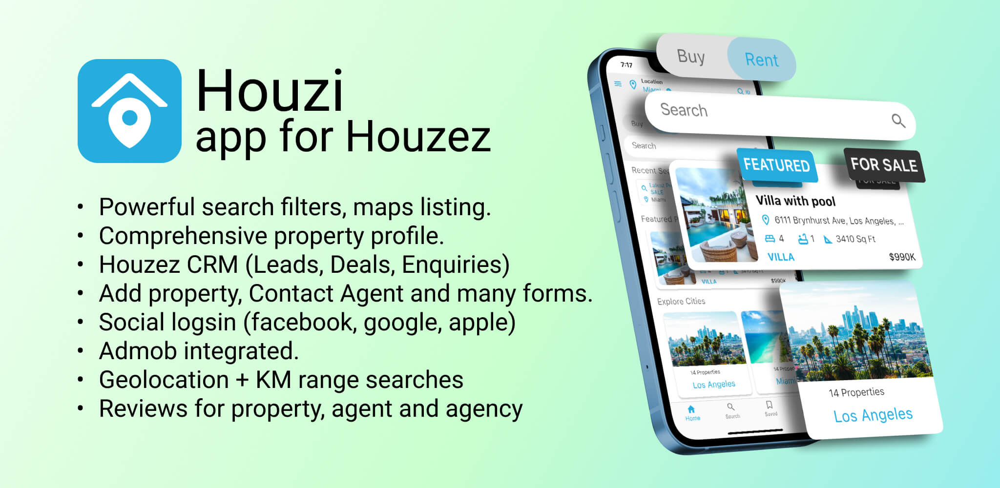

This is rest api plugin for for Houzi Flutter App.

Houzi a real estate mobile application that connects with Houzez Wordpress theme. Its build with Flutter so it can be deployed to Android and iOS.

Visit website here: https://houzi.booleanbites.com

This documentation consist of two parts.

### [Tools](https://houzi-docs.booleanbites.com/tools/xcode_setup)

This section addresses all the tools and other environment configurations you need to do get the development started.

#### [App Setup](https://houzi-docs.booleanbites.com/app-setup/change_url)

This section guides through all the steps related to app setup and customization.

#### [Houzi Config Builder](https://houzi-docs.booleanbites.com/houzi-config-builder/introduction)

This section talks about designing and generating configuration with Houzi Builder, that can be used in the app.

### Try the demo app here:

   
